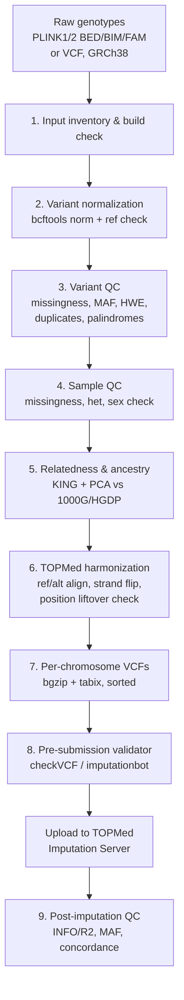

# array_imputation_prep

Methods and scripts to implement best-practice, state-of-the-art preparation
of GWAS array genotype data for imputation against the **TOPMed r3 reference
panel** on the
[TOPMed Imputation Server](https://imputation.biodatacatalyst.nhlbi.nih.gov/)
(human genome build **GRCh38 / hg38**).

The goal is a robust, reproducible, container-friendly pipeline that maximizes
the number and quality of imputed variants across diverse ancestries while
catching the failure modes that most often cause imputation jobs to be
rejected by the server.

> **Status:** Design phase. This repository currently contains the pipeline
> design document and references. Scripts and the containerized workflow
> implementation will follow in subsequent PRs that reference this design.

---

## Documents

| File | Purpose |
| --- | --- |
| [`docs/pipeline_design.md`](docs/pipeline_design.md) | Full pipeline design: step-by-step rationale, QC thresholds, tools, decision points, and a flow diagram. |
| [`docs/references.md`](docs/references.md) | Curated literature, consortium SOPs, and tool documentation that justify the design choices. |

---

## Pipeline at a glance



See [`docs/pipeline_design.md`](docs/pipeline_design.md) for the rationale and
exact commands for each step.

---

## Quick start (planned interface)

The pipeline is being developed as a containerized workflow. Once the
implementation lands, typical usage will be:

```bash
# 1. Pull the container (planned)
docker pull ghcr.io/jlanej/array_imputation_prep:latest

# 2. Run the prep pipeline on a PLINK fileset (GRCh38)
docker run --rm -v "$PWD":/data ghcr.io/jlanej/array_imputation_prep:latest \
    prep \
    --bfile     /data/cohort_hg38 \
    --out-dir   /data/imputation_ready \
    --build     hg38 \
    --ref-fasta /data/GRCh38_full_analysis_set_plus_decoy_hla.fa \
    --threads   8

# 3. Submit the per-chromosome VCFs in imputation_ready/vcf/ to the
#    TOPMed Imputation Server (r3, EAGLE phasing, Minimac4).
```

Inputs:

- PLINK1.9 `bed/bim/fam` **or** PLINK2 `pgen/pvar/psam` **or** VCF/BCF, on
  **GRCh38**. (If your data are on GRCh37, lift over with the documented
  `liftOver` + re-normalize procedure before running this pipeline.)
- GRCh38 reference FASTA used by the TOPMed panel
  (`GRCh38_full_analysis_set_plus_decoy_hla.fa`).
- Optional sample metadata TSV (sex, self-reported ancestry, phenotype) for
  reporting.

Outputs (under `--out-dir`):

- `vcf/chr{1..22,X}.vcf.gz` — sorted, bgzipped, tabix-indexed,
  TOPMed-ready per-chromosome VCFs.
- `qc/` — PLINK / KING / PCA reports and a `TableOne`-style sample summary.
- `logs/` — per-step logs and command provenance.
- `report.html` — human-readable QC + decision report.

---

## Tooling

The pipeline standardizes on the following open-source tools (versions pinned
in the container):

- [PLINK 2.0](https://www.cog-genomics.org/plink/2.0/) — variant/sample QC.
- [PLINK 1.9](https://www.cog-genomics.org/plink/) — legacy operations where
  PLINK2 lacks parity (e.g., `--check-sex` on small panels).
- [bcftools](https://samtools.github.io/bcftools/bcftools.html) — VCF
  normalization, ref/alt alignment, sorting, indexing.
- [KING](https://www.kingrelatedness.com/) — relatedness inference robust to
  population structure.
- [Eagle](https://alkesgroup.broadinstitute.org/Eagle/) /
  [Minimac4](https://github.com/statgen/Minimac4) — invoked server-side by
  TOPMed; documented here for reproducibility of post-imputation QC.
- [checkVCF.py](https://github.com/zhanxw/checkVCF) and
  [imputationbot](https://github.com/lukfor/imputationbot) — pre-submission
  validation.
- R (`TableOne`, `ggplot2`) — summary reports.
- Docker + GitHub Actions — reproducibility and CI.

---

## License

See [`LICENSE`](LICENSE).
